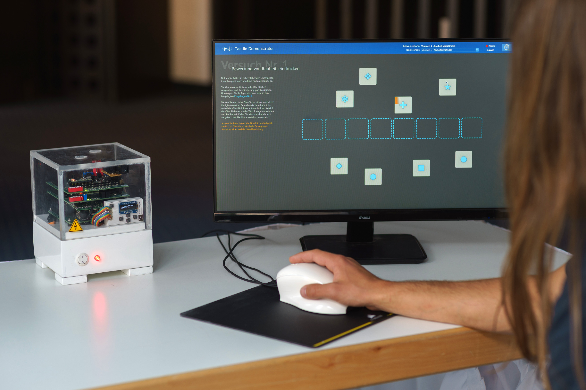
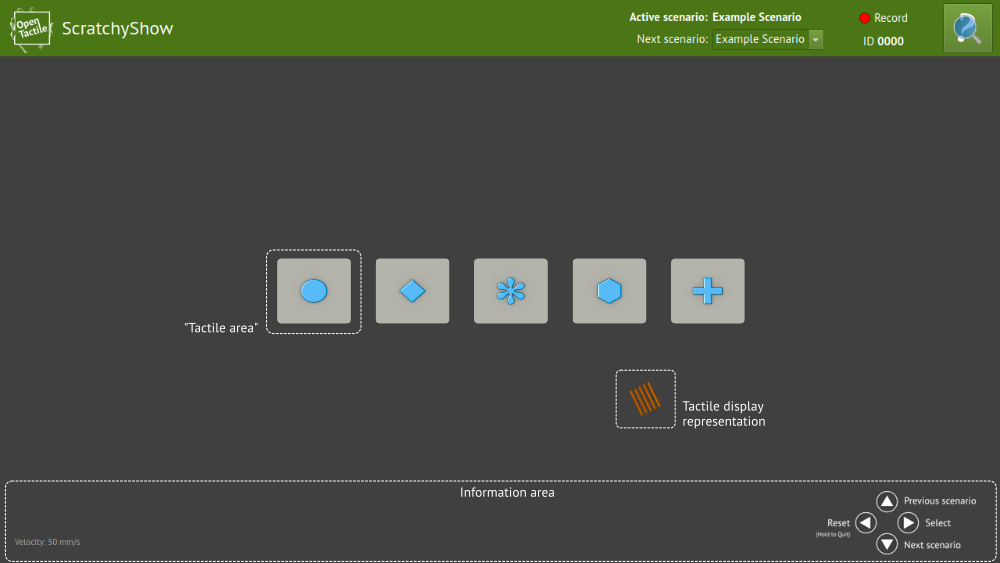

# ScratchyShow

ScratchyShow is a graphical user interface to [SCRATCHy](https://github.com/OpenTactile/SCRATCHy) and [ITCHy](https://github.com/OpenTactile/SCRATCHy) - The open hardware- and software-plattform for controlling tactile displays.


*This documentation is currently under development*

## Application dependencies
ScratchyShow requires the following dependencies to be installed:
- [libSCRATCHy](https://github.com/OpenTactile/SCRATCHy)
- [libITCHy](https://github.com/OpenTactile/ITCHy)
- [Qt 5.9](https://www.qt.io/)
- [libusb](http://libusb.info/)

## Building ScratchyShow
ScratchyShow uses the qmake build system and is available for linux platforms only. For building and installing the application system-wide, please follow these steps within the base directory:

```bash
mkdir ScratchyShow-build
cd ScratchyShow-build
qmake ..
make && make install
```

#### Using *fake mode*
If you intend to test and/or extend ScratchyShow on a personal computer (not using the Raspberry Pi 3), you may pass an additional configuration option to qmake that disables some platform specific tests at runtime

```bash
qmake ../ScratchyShow.pro CONFIG+=fake
make && make install
```
Please make sure that libSCRATCHy and libITCHy are build with this option as well.


## Running the application
Before running ScratchyShow, please make sure that the folders `logs` and `tactileScenes` exist within the current working directory.
The application then can be started by simply executing
```bash
ScratchyShow
```
inside a terminal session. For a first test afer building the application, you may want to test the example scene that comes with the source code:
```bash
cd workingdir
mkdir logs
ScratchyShow
```


#### Basic usage
After starting ScratchyShow for the first time, a window similar to the following image should appear:

When starting the application, an example scenario file is loaded automatically. This file contains a description defining several *tactile Areas* that can be placed freely inside the workspace. The current position and orientation of the tactile display is represented by a graphical depiction of the individual actuators that can be configured easily (see the respective section below). As long as the actual size of the monitor is indicated to the system, all graphical elements should match the metrical dimensions given in the scenario description.

The bottom area (denoted as "Information area") contains additional ui elements, such as the current velocity of the tactile display and a graphical guide showing the button layout of the (optional) DisplayBoard of SCRATCHy. This area can be configured to be hidden using the "Config" section of the scenario description.

In the top right of the window, three more functions can be accessed using the mouse. From left to right:
- **Scenario selection**
Using the drop down box, one can choose among all scenario files that are placed inside the `tactileScenes` directory. By selecting an entry using the mouse, the corresponding scenario file will be loaded instantly. Contrarily, when using the DisplayBoard, the user can switch between the scenarios by using the *up* and *down* buttons. The selected scenario will be loaded once the *select* button is pressed.
- **Logging system**
See the next section for a detailed explanation
- **Reveal button**
The graphical representations of the tactile Areas contain two states: *Hidden* (default) and *Visible*
By using this button, the state of all areas of the current scenario will be toggled. This functionality is intended to be used e.g. for double-blinded user studies where the system chooses a random model for each area. After the user made a choice/statement the button allows to check whether the answer was correct or not.

###### Drag and Drop
Depending on the options given in the current scenario file, *drag and drop* may be enabled for individual tactile areas. This allows to "grab" the area using the thumb button of the tactile mouse and rearrange them.

###### Graphical decoration
By using the `NullModel` (that will not cause the tactile display to be activated) the scenario can be "decorated" using arbitrary graphics such as texts or pictograms. One can, for example, place user instructions next to the tactile areas.

#### Logging system
After hitting the *Record* button in the upper right of the screen, a random ID between 0000 and 9999 that has not been used before will be generated and a new logging session is started. During this session, user interaction will be recorded including:
- Loading/Changing the active scenario file
- Drag and Drop actions (moving tactile areas with the thumb button of ITCHy)
- Average movement velocity and hover time for each tactile area
- Timestamps for each action
- Disclosure of the random choices the system has made
- Final position of each tactile area

By clicking the button a second time, the logging session will be stopped.
The results of the session then can be found within the `logs` directory of the current working directory. Here two files e.g. `1234.log` and `1234.csv` will be created. While the `.log` file contains a rather verbous, textual description of the logging session, the `.csv` file is formatted in a more "computer friendly" way that allows for automated analysis.

#### Running without X Server
Since Qt allows to run applications independently of a X session, ScratchyShow can be run directly from console without needing a window manager.
More information can be found on the [Qt for Embedded Linux](http://doc.qt.io/qt-5/embedded-linux.html) website.

The following commandline allows to run ScratchyShow without using X:
`ScratchyShow -plugin EvdevMouse -plugin EvdevKeyboard -platform linuxfb`
or - if Qt has been configured with OpenGL support - the following command may result in better graphical performance on the Raspberry Pi 3:
`ScratchyShow -plugin EvdevMouse -plugin EvdevKeyboard -platform eglfs`

## Creating scenarios
The drop-down box in the upper right of the UI contains a list of scenarios that can be specified by the user.
It is populated during application start with the files ending with `.tsc` (**T**actile**Sc**enario) found in the ``tactileScenes`` folder. The items will be arranged in ascending order based on the filename.

Each tactile scenario consists of a human-readable and -editable description of a scene that may contain numerous *tactile areas*, i.e. regions on the screen that activate a specific *model* driving the tactile display. Additionally, some "inactive" regions may be specified in order to add graphical elements to e.g. guide the user. (A complex example can be seen on the title graphic showing a scene used in an actual user study.) The *tactile areas* also can be configured to be "draggable" allowing to grab them with the thumb-button of the tactile mouse, resulting in more interactive experiments.

#### Format of *.tsc* files
Let's have a look on the example file that will be loaded automatically on first start
(it is located in the `workingdir/tactileScenes` folder):
```cpp
Example Scenario

Config {
    BackgroundColor = #404040
    Translate[0] = 0.0
    Translate[1] = 0.0
    DisableSecretButton = False
    HideToolbar = False
}

Scene {
    -8;-1.5;3;3 | surface_graphics/circle.png;bump_plates/circle.png   | Frequency;250.0;0.9;false;false;0.0 | true
    -4;-1.5;3;3 | surface_graphics/diamond.png;bump_plates/diamond.png | Frequency;50.0;0.9;false;false;0.2  | true
     0;-1.5;3;3 | surface_graphics/flake.png;bump_plates/flake.png     | Frequency;100.0;0.9;true;false;0.4  | true
     4;-1.5;3;3 | surface_graphics/hexagon.png;bump_plates/hexagon.png | Frequency;250.0;0.9;false;true;0.6  | true
     8;-1.5;3;3 | surface_graphics/plus.png;bump_plates/plus.png       | Frequency;250.0;0.9;true;true;0.8   | true
}
```
Each `.tsc` file follows a specific pattern:

- Lines beginning with *#* will be treated as comments and therefore be ignored.
- The first (non-comment) line specifies the *name* of the scenario that will be displayed in the drop-down box.
- A *Config* block allows to change the look and behaviour of the UI.
- A (optional) *Substitute* block can be used to create randomized scenarions (will be discussed in the follow-up example).
- The *Scene* block specifies the actual tactile areas to be displayed.

##### The *Config* section
In this section, the following options can be specified in order to manipulate the appearance of the UI:
- **BackgroundColor**: Allows to change the base color of the main window, has to be specified in HTML notation (`#RRGGBB`).
- **Translate[0]**: Moves the viewport anchor in x-direction (in metres).
- **Translate[1]**: Moves the viewport anchor in y-direction (in metres).
- **DisableSecretButton**: Makes the "Reveal" button in the upper right of the UI insensitiv if set to `True`.
- **HideToolbar**: Completely removes the "Information area" if set to `True`
- *Additional options will probably be added in future releases.*

Any other values specified in this area will act as a *string substitution* within the *Scene* section. For example if one specifies `extension = png` in the *Config* section, all occurences of `extension` will be substituted in the *Scene* section, so 
```cpp
surface_graphics/circle.extension
```
will become
```cpp
surface_graphics/circle.png
```
Please be aware that no sanity checks will be made when substituting, so it might not be a particular good idea to specify e.g. `a = b`.

##### The *Scene* section
Each line in this section defines a single *tactile area* following the pattern
```cpp
 PositionX;PositionY;Width;Height | HiddenGraphic;RevealedGraphic | ModelName;[ModelParameters,...] | DragDrop
```
The position and size of each area are given in centimetres with the point (0, 0) being located at the center of the screen (unless a translation has been specified in the config section).

The `HiddenGraphic` field hold the relative path to a *.png* or *.jpg* file that will be used to represent the *tactile area* after the scene has been loaded. This representation will be substituted by the file given in `RevealedGraphic` as soon as the *Reveal button* in the upper right of the UI is pressed. The size of the image should be *100 pixels per centimetre* and should match the specified `Width` and `Height`.

The `ModelName` field specifies the model to be assigned to this area. (See below for a tutorial on how to define custom models.) Currently, ScratchyShow contains two pre-defined models:

- `Null`: This model resets the voltages of all actuators to *0V*. It is meant to be used for specifying decorative areas/graphics.
- `Frequency`: This model accepts the additional arguments `Frequency;Amplitude;ScaleFrequency;ScaleAmplitude;Hue`
`Frequency` (ranging from 0.0 to 1000.0) and `Amplitude` (ranging from 0.0 to 1.0 (0-100% of the driving voltage)) will affect all actuators of the tactile display simultaneously. In case `ScaleFrequency` and/or `ScaleAmplitude` is set to `true`, the frequency and/or amplitudes will be scaled linearly with the current velocity of the tactile mouse, forming a very "simple model" to drive the display. The last option `Hue` will cause the RGB LED to change color according to the [HSL color model](https://en.wikipedia.org/wiki/HSL_and_HSV).

The `DragDrop` field specifies whether the tactile area can be grabbed and moved around using the thumb-button of the tactile mouse or not.


##### The *Substitute* section
This section allows to randomize parts of the scenario thus allowing to e.g. create randomized user studies.
Similar to the *Config* section, identifiers can be specified that will be substituted within the *Scene* section.

Here is another example scenario, that will place the areas at randomized positions and changing there sizes:

```cpp
Randomization Example Scenario

Config {
    graphics = surface_graphics/circle.png;bump_plates/circle.png
    model = Frequency;250.0;0.5;false;false;0.0
}

Substitute {
    POSX = ( 0.0 | 1.0 | 2.0 | 3.0 | 4.0 | 5.0 | 6.0 | 7.0 )
    POSY = ( 0.0 | 1.0 | 2.0 | 3.0 | 4.0 | 5.0 | 6.0 | 7.0 )
    SIZE = ( 1;1 | 2;2 | 3;3 )
}

Scene {
    %POSX0%;%POSY0%;%SIZE0% | graphics | model | false
    %POSX1%;%POSY1%;%SIZE1% | graphics | model | false
    %POSX2%;%POSY2%;%SIZE2% | graphics | model | false
}
```
Here, three *substitution tuples* have been specified using the following format:
```cpp
POSX = ( 0.0 | 1.0 | 2.0 | 3.0 | 4.0 | 5.0 | 6.0 | 7.0 )
```
Each entry of the tuple (enclosed by parentheses) is separated using the "pipe" symbol "|". When the scene is loaded, all  entries of the tuple will be *randomly permutated*. For example, the following permutation could be possible:
```cpp
POSX = ( 5.0 | 0.0 | 2.0 | 7.0 | 6.0 | 1.0 | 4.0 | 3.0 )
          |                 |                       |
       %POSX0%           %POSX3%                 %POSX7%
```
Each entry can be accessed individually using the scheme shown in this example. In this case, all occurences of `%POS3%` within the *Scene* section will be substituted with `7.0`. Please note that the tuple entries are not limited to numbers. They may contain arbitrary strings such as filenames, model arguments, etc. as well.


#### Calibrating the monitor
In order to take the size of the screen into account (so 1cm travelled with ITCHy translates to 1cm on the screen), please edit the file `hdmiscreen.cpp` within the `view` folder:
```cpp
const float screenWidth = 0.52f;
const float screenHeight = 0.25f;
```
These values are given in metres.
(We will make this configurable through the scene-file in future releases.)

#### Tactile display definition
Currently the definition of the tactile display takes place within the `main.cpp`.
(This will be moved to the scene-file as well in future releases.)
Having a look on lines 65-71 reveals the standard definition:
```cpp
TactileDisplay tactileDisplay;

tactileDisplay << Actuator(QVector2D(-4.0, 0.0), QVector2D(0.71, 12.5),  0, 1, 2)
               << Actuator(QVector2D(-2.0, 0.0), QVector2D(0.71, 12.5),  0, 1, 0)
               << Actuator(QVector2D( 0.0, 0.0), QVector2D(0.71, 12.5),  0, 2, 0)
               << Actuator(QVector2D( 2.0, 0.0), QVector2D(0.71, 12.5),  0, 1, 1)
               << Actuator(QVector2D( 4.0, 0.0), QVector2D(0.71, 12.5),  0, 1, 3);
```
Following this scheme, as many actuators as needed may be added to the tactile display object.
The example given above creates a single-row tactile display definition consisting of five actuators evenly spaced with a distance of 2mm between individual actuators.
The Actuator constructor's arguments are organized as follows:
```
Actuator(position, size, map, port, pin)
```
The first two arguments should be self-explanatory. (The `size` argument is only for cosmetical purposes and defines its graphical representation within the GUI.)
The `map` argument is currently not used internally and may be used on your own behalf (it can be accessed within the model for example).
`port` (ranging from 0 to 128) denotes the hardware address of the SignalBoard that is connected to the specific actuator,
whereas `pin` (ranging from 0 to 3) chooses from its 4 output channels.

In case the display configuration does not match the actual addresses of the SignalBoards, this inconsistency will be detected automatically causing the application to display an error message.

## Implementing own models
Currently there are two pre-defined models available that can be used as a starting point for own experiments.
The `NullModel` resets the SignalBoard's outputs to zero and is intended to act as a placeholder for e.g. adding graphical decorative elements to the scene.
The `FrequencyModel` is a minimal example model that scales a given frequency (and/or the amplitude) linearly with the current velocity of the display and also sets the RGB LED of ITCHy to a specific color that is given in the scene description.

New models have to be registered within the `main.cpp` as follows:
```cpp
Scene scene(&tactileDisplay, currentPosition);

scene.registerModel("Frequency", Factory<FrequencyModel>());
scene.registerModel("Null", Factory<NullModel>());

scene.registerModel("YourModel", Factory<YourModel>());
```

#### C++ interface
New Models can be defined by implementing the `Model` interface.
Here is a minimum example, that just sets the frequency and amplitude of all actuators to a fixed value given in the scene description:
```cpp
#include "model/model.h"

class ExampleModel : public Model
{
public:
    ExampleModel() {}
    virtual ~ExampleModel() {}
    virtual void initialize(const QStringList& options,PositionQuery* position, QRectF bounds)
    {
    	frequency = options[0].toFloat();
        amplitude = options[1].toFloat();
    }

    virtual void apply(const TactileDisplay* display, QVector<FrequencyTable>& tables)
    {
        for(FrequencyTable& tab : tables)
        {
            for(fixed_q5& frequency : tab.frequency)
                frequency = this->frequency;
            for(fixed_q15& amplitude : tab.amplitude)
                amplitude = this->amplitude;
        }
    }

private:
	float frequency = 0.0f;
    float amplitude = 0.0f;
};
```
The `initialize` method will be called once when the scene is loaded and the model instanciated. Here, the `options` list will hold all arguments that have been specified in the scene description file for the particular tactile area. `position` provides a basic interface to ITCHy (or a normal computer-mouse if ITCHy is not connected) that allows to access position information as well as buttons and the RGB LED. This pointer may be saved locally and can then be accessed within the `apply` method. The last argument `bounds` specifies the dimension of the tactile area in metres.

The `apply` method will be called regularly whenever the tactile mouse is positioned within the bounds of the tactile area. The `display` argument gives access to the current *transformed* status of the individual actuators, their actual *absolute* position in metres as well as their current velocity in m/s. In order to change the outputs of the SignalBoards, the values within the `tables` list can be manipulated directly. The indices of the FrequencyTables point to the actuators in the same order as has been specified in the original definition of the TactileDisplay object.

After this new model has been registered within the `main.cpp` by adding
```cpp
scene.registerModel("Example", Factory<ExampleModel>());
```
a new instance of this model can be defined in a scene description file
```
0;0;5;5 | somegraphic.png;somegraphic.png | Example;250.0;0.9 | false
```
This will create a 5cm x 5cm sized tactile area in the center of the screen that causes the whole tactile display to vibrate with a frequency of 250Hz at a high amplitude when moving the tactile mouse over it.


#### Python interface
The Python interface is currently in development and will be exposed using a special pre-defined `PythonModel`. We will give additional examples in future releases.
